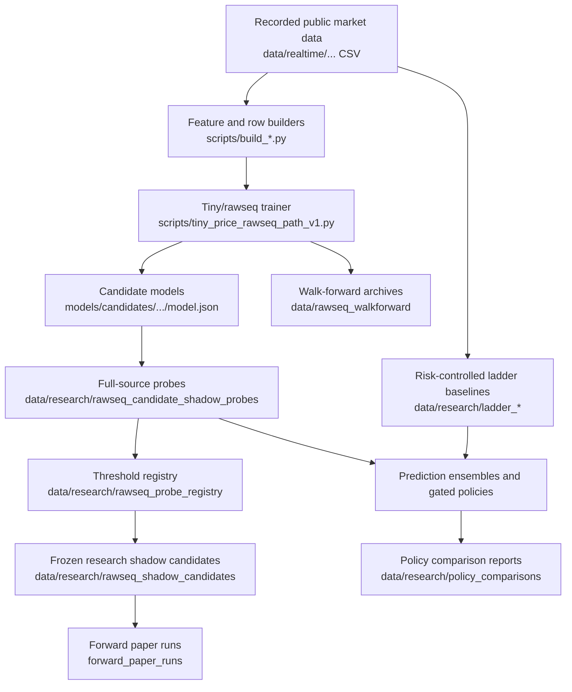

# AITicker Misc Mega README

_Last generated: 2026-07-10 16:10:51Z from a static scan of the local repository._

_Manual update: 2026-07-10 23:55Z. Added the canonical rawseq schema/data-contract packet, source-column inventory, schema audit outputs, and updated directory notes. No training, tuning, promotion, champion mutation, private API, or orders were run during this documentation refresh._

_Manual update: 2026-07-11 00:25Z. Added the rawseq feature diagnostic registry and feature-family ablation-unit manifest. This was a report-only diagnostics pass over existing artifacts._

## Overview

This workspace is a research-heavy crypto market microstructure and tiny-model lab. It contains Node/browser experiments, Python feature builders, live/public data recorders, model trainers, backtests, raw sequence (`rawseq`) candidate discovery, paper-only shadow candidate evaluation, ladder/grid baseline simulation, and reporting utilities.

The current center of gravity is SOLUSDT/Kraken recorded-public flow research. Most newer rawseq, ladder, policy-comparison, registry, and shadow-candidate scripts are report-only or paper-only, with explicit no-orders/no-promotion/no-champion-mutation intent.

## Current Status

- Source files cataloged: **245**.
- Catalog rows including generated-data summaries: **254**.
- Environment variables documented from code scans: **1460**.
- Python/Node entry-point style scripts detected: **200**.
- Generated artifact families summarized: **9**.
- Working tree statuses seen during scan: modified=12, tracked=231, untracked=2.
- Latest schema-contract audit: `data/research/rawseq_schema_contracts/rawseq_schema_contract_20260710T235110Z`, status `WARN` with 0 unregistered feature columns and 0 unregistered target columns.
- Latest source-column inventory: `data/research/rawseq_source_column_inventory/rawseq_source_column_inventory_20260710T234830Z`.
- Latest feature diagnostics: `data/research/rawseq_feature_diagnostic_registry/rawseq_feature_diagnostic_registry_20260711T002251Z`, covering 267 materialized features and 6 target horizons.
- Current rawseq stage: schema registration and column lineage are substantially complete; formula documentation is incomplete; column diagnostics are produced; feature-family ablation is the next bounded modeling step; model tuning and freezeable training remain later.

## Safety Posture

Treat this repository as a research and paper-trading workspace unless a script has been explicitly audited for live operation. Before running scripts whose names include `live`, `promotion`, `champion`, `active`, `selected`, or exchange/API language, read the source and environment variables first.

Newer research scripts should preserve:

- no private API use,
- no exchange orders,
- no promotion,
- no mutation of `data/paper_champions`,
- no champion freeze unless a separate explicit freeze/audit workflow is invoked.

## Architecture



## Directory Map

| Path | Role | Source-control guidance |
| --- | --- | --- |
| scripts/ | Python/Node builders, trainers, evaluators, recorders, and reports. | Commit source; review live/promotion scripts carefully. |
| scripts/tiny/ | Rawseq, shadow-candidate, ladder, registry, ensemble, and policy research tools. | Commit source; outputs go under data/research or data/rawseq_* folders. |
| configs/rawseq/ | Canonical rawseq schema JSON for feature definitions, labels, feature groups, and tensor contracts. | Commit schema source; treat as versioned contract material. |
| src/ | Node/browser market data and modeling utilities. | Commit source. |
| tiny/core/ | Shared tiny path and I/O helpers. | Commit source. |
| tests/ | Focused regression tests for helper contracts and rawseq guards. | Commit tests. |
| docs/ | Human documentation and workflow notes. | Commit docs. |
| data/ | Recorded/generated datasets, reports, paper candidates, and research artifacts. | Usually do not commit bulk files. |
| models/ | Candidate/active/selected model artifacts. | Usually do not commit unless explicitly freezing an artifact. |

For AI handoffs and manual command sequences, start with [`docs/AI_PROJECT_TUTORIALS.txt`](docs/AI_PROJECT_TUTORIALS.txt). It is a plain-text runbook designed for ChatGPT/Codex readability.

## Rawseq Concepts

Rawseq models consume a fixed-length sequence of scalar input values and predict a path-shaped output. The core trainer is [`scripts/tiny_price_rawseq_path_v1.py`](scripts/tiny_price_rawseq_path_v1.py). Orchestration lives in [`scripts/tiny/run_rawseq_recorded_walkforward_evolution.py`](scripts/tiny/run_rawseq_recorded_walkforward_evolution.py) and [`scripts/tiny/run_rawseq_io_contract_discovery_batch.py`](scripts/tiny/run_rawseq_io_contract_discovery_batch.py).

Important contract fields include `symbol`, venue, `source_path`, `bucket_seconds`, `seq_len`, input/output stride, `input_feature`, `ma_window`, `feature_window`, hidden architecture, inferred `W1`/`W2`/`W3` shapes, `output_label`, `output_orientation`, `task_type`, `output_dim`, seed, population, generations, epochs, split windows, source hashes, and safety metadata.

## Canonical Rawseq Schema Contract

The canonical rawseq data contract now lives under [`configs/rawseq`](configs/rawseq):

- [`rawseq_feature_schema_v1.json`](configs/rawseq/rawseq_feature_schema_v1.json): source-column, feature-window, causality, missing-value, scaling, and policy compatibility definitions.
- [`rawseq_label_schema_v1.json`](configs/rawseq/rawseq_label_schema_v1.json): output labels, target layouts, horizon semantics, leakage warnings, and compatible policy adapters.
- [`rawseq_feature_groups_v1.json`](configs/rawseq/rawseq_feature_groups_v1.json): feature-family grouping used by multi-horizon indicator artifacts.
- [`rawseq_tensor_contracts_v1.json`](configs/rawseq/rawseq_tensor_contracts_v1.json): tensor layouts, required arrays, split/timestamp semantics, and shape contracts.

The JSON-backed registry remains exposed through [`scripts/tiny/rawseq_feature_label_registry.py`](scripts/tiny/rawseq_feature_label_registry.py). The source-column inventory is generated by [`scripts/tiny/report_rawseq_source_column_inventory.py`](scripts/tiny/report_rawseq_source_column_inventory.py). The full artifact/schema audit is generated by [`scripts/tiny/report_rawseq_schema_contracts.py`](scripts/tiny/report_rawseq_schema_contracts.py).

Latest audit packet:

- `data/research/rawseq_schema_contracts/rawseq_schema_contract_20260710T235110Z/schema_contract.json`
- `data/research/rawseq_schema_contracts/rawseq_schema_contract_20260710T235110Z/schema_audit_summary.md`
- `data/research/rawseq_schema_contracts/rawseq_schema_contract_20260710T235110Z/source_column_inventory.csv`
- `data/research/rawseq_schema_contracts/rawseq_schema_contract_20260710T235110Z/rawseq_column_lineage.csv`

The latest audit is `WARN`, not `FAIL`: old sequence artifacts lack optional newly introduced arrays, and 139 materialized formulas remain implementation-specific/unresolved for documentation. There are 0 unregistered feature columns and 0 unregistered target columns.

## Feature Diagnostic Registry

The current feature diagnostic registry is generated by [`scripts/tiny/report_rawseq_feature_diagnostic_registry.py`](scripts/tiny/report_rawseq_feature_diagnostic_registry.py). It is report-only and computes per-materialized-feature diagnostics:

- variance, nonfinite fraction, missing fraction, constant/near-constant status, and extreme-value rate,
- train-fitted scaler parameters and validation out-of-range rate,
- correlation against every target horizon,
- univariate train/validation baseline metrics,
- time-block stability,
- redundancy cluster membership,
- feature-family membership,
- recommended action: `keep`, `keep_for_ablation`, `redundant`, `unstable`, `invalid`, or `unresolved`.

Latest packet:

- `data/research/rawseq_feature_diagnostic_registry/rawseq_feature_diagnostic_registry_20260711T002251Z/feature_diagnostic_registry.csv`
- `data/research/rawseq_feature_diagnostic_registry/rawseq_feature_diagnostic_registry_20260711T002251Z/feature_target_correlations.csv`
- `data/research/rawseq_feature_diagnostic_registry/rawseq_feature_diagnostic_registry_20260711T002251Z/feature_univariate_baselines.csv`
- `data/research/rawseq_feature_diagnostic_registry/rawseq_feature_diagnostic_registry_20260711T002251Z/feature_family_ablation_units.csv`

Latest action counts: `keep=68`, `redundant=16`, `unstable=4`, `invalid=106`, `unresolved=73`. Invalid and unresolved features should not be used in freezeable model contracts. Redundant/unstable/keep-for-ablation features may be useful for research ablation, but should not be promoted blindly.

Controlled ablation units are now emitted as `raw`, `raw_plus_trend`, `raw_plus_momentum`, `raw_plus_volatility`, `raw_plus_breakout`, `raw_plus_volume`, `raw_plus_order_book`, `raw_plus_regime`, `raw_plus_cross_market`, `all_registered_features`, and `all_minus_<family>`.

## Rawseq Input Features

The registry script [`scripts/tiny/rawseq_feature_label_registry.py`](scripts/tiny/rawseq_feature_label_registry.py) documents the intended feature surface. Features in the current rawseq family include:

- `return` / `signed_bucket_return_bps`: bucket return in basis points.
- `ma_distance`: distance from a moving average window.
- `ma_slope`: moving-average slope.
- `rolling_volatility_bps`: rolling standard deviation of bucket returns.
- `rolling_range_bps`: rolling high/low range in bps.
- `distance_to_recent_high_bps`: current price relative to recent rolling high.
- `distance_to_recent_low_bps`: current price relative to recent rolling low.

For non-return features, verify the relevant window field is preserved in `model.json`, `model_contract.json`, candidate rows, and probe reports before comparing candidates.

## Output Labels and Envelope Semantics

Current regression labels are:

- `future_return_path`: signed/log future return path from now to each future step.
- `future_high_from_now_bps_path`: cumulative maximum future log-return from now through step `k`, including zero so high paths are nonnegative.
- `future_low_from_now_bps_path`: cumulative minimum future log-return from now through step `k`, including zero so low paths are nonpositive.
- `future_range_envelope_path`: concatenated high path and low path; for `seq_len=60`, `output_dim=120`.

The high/low/envelope labels should use `output_orientation=market_relative`. Legacy `future_return_path` behavior remains side-relative unless a script explicitly overrides it. Registry-level labels such as `barrier_hit_levels` and `tp_before_stop_by_rung` should not be assumed fully trainable unless the trainer/evaluator explicitly supports them.

## Fitness, Baselines, and Guards

For `future_return_path`, existing trading-policy evaluation should remain unchanged. For high/low/envelope labels, ranking is label-metric aware: path RMSE/MAE, terminal correlations, monotonicity checks, envelope order checks, barrier-hit diagnostics, and TP-before-danger diagnostics.

Baseline guards are critical. A high/low/envelope model that does not beat the training-mean RMSE baseline on the untouched test split should receive a guarded label score of `-1000000000.0` and should remain available only for diagnosis, not for selected-window or quality leaderboards.

## Run-Until-Success Discovery

[`scripts/tiny/run_rawseq_io_contract_discovery_batch.py`](scripts/tiny/run_rawseq_io_contract_discovery_batch.py) is the bounded wrapper for generating candidate attempts from an I/O contract grid. It should persist attempts, successful candidates, failed attempts, completed seeds, and run state after each attempt. Fatal infrastructure failures should stop immediately; retryable training/label failures may continue within configured bounds. A quality-gate miss should mark a model rejected/research-only, not delete it.

## Windows Path Handling

Rawseq discovery and walk-forward wrappers use compact deterministic filesystem slugs and short temporary file names to avoid Windows path-length failures. Directory names are identifiers, not metadata; the complete contract belongs in `contract.json`, `model_contract.json`, candidate CSVs, and selected summary artifacts.

## Shadow Candidate Lifecycle

1. Generate rawseq I/O contracts with [`scripts/tiny/rawseq_io_contract_grid.py`](scripts/tiny/rawseq_io_contract_grid.py).
2. Run bounded discovery with [`scripts/tiny/run_rawseq_io_contract_discovery_batch.py`](scripts/tiny/run_rawseq_io_contract_discovery_batch.py).
3. Select survivors with [`scripts/tiny/report_rawseq_walkforward_contract_survivors.py`](scripts/tiny/report_rawseq_walkforward_contract_survivors.py).
4. Probe candidates with [`scripts/tiny/run_rawseq_candidate_shadow_probe.py`](scripts/tiny/run_rawseq_candidate_shadow_probe.py).
5. Decide/register thresholds with [`scripts/tiny/report_rawseq_candidate_probe_decision.py`](scripts/tiny/report_rawseq_candidate_probe_decision.py) and [`scripts/tiny/report_rawseq_probe_threshold_registry.py`](scripts/tiny/report_rawseq_probe_threshold_registry.py).
6. Optionally freeze a research shadow candidate with [`scripts/tiny/freeze_shadow_candidate.py`](scripts/tiny/freeze_shadow_candidate.py).
7. Run forward paper evaluation with [`scripts/tiny/run_frozen_shadow_candidate_forward_paper.py`](scripts/tiny/run_frozen_shadow_candidate_forward_paper.py).
8. Compare candidates with [`scripts/tiny/report_shadow_candidate_forward_comparison.py`](scripts/tiny/report_shadow_candidate_forward_comparison.py).

## Ladder and Policy Research

The ladder/grid baseline is paper-only and risk-controlled. Main scripts are [`scripts/tiny/simulate_path_aware_ladder_baseline.py`](scripts/tiny/simulate_path_aware_ladder_baseline.py), [`scripts/tiny/validate_ladder_baseline_walkforward.py`](scripts/tiny/validate_ladder_baseline_walkforward.py), [`scripts/tiny/sweep_ladder_risk_walkforward.py`](scripts/tiny/sweep_ladder_risk_walkforward.py), [`scripts/tiny/report_ladder_walkforward_failure_attribution.py`](scripts/tiny/report_ladder_walkforward_failure_attribution.py), and [`scripts/tiny/compare_rawseq_vs_ladder_policies.py`](scripts/tiny/compare_rawseq_vs_ladder_policies.py).

## Quick Start

Use PowerShell from the repository root.

```powershell
python -m py_compile scripts/tiny_price_rawseq_path_v1.py scripts/tiny/rawseq_io_contract_grid.py scripts/tiny/run_rawseq_io_contract_discovery_batch.py

$env:RAWSEQ_IO_INPUT_FEATURES = "return,ma_distance"
$env:RAWSEQ_IO_MA_WINDOWS = "60,150"
$env:RAWSEQ_IO_OUTPUT_LABELS = "future_return_path,future_range_envelope_path"
python scripts/tiny/rawseq_io_contract_grid.py

$env:RAWSEQ_IO_DISCOVERY_POPULATION = "2"
$env:RAWSEQ_IO_DISCOVERY_GENERATIONS = "1"
$env:RAWSEQ_IO_DISCOVERY_EPOCHS = "2"
python scripts/tiny/run_rawseq_io_contract_discovery_batch.py

$env:LADDER_SWEEP_SMOKE_MODE = "true"
$env:LADDER_MAX_CONFIGS = "25"
python scripts/tiny/sweep_ladder_risk_walkforward.py
```

## Output Artifacts

Common artifacts include `model.json`, `model_contract.json`, `feature_audit.csv`, `label_metric_summary.csv`, `label_shape_audit.csv`, `candidates.csv`, `all_window_candidates.csv`, `selected_by_window.csv`, `contract_leaderboard.csv`, `attempts.csv`, `successful_candidates.csv`, `failed_attempts.csv`, `run_state.json`, `decision_summary.csv/txt`, `dynamic_cost_summary.csv/txt`, and `forward_summary.csv/txt`.

## Testing and Validation

```powershell
python -m py_compile scripts/tiny_price_rawseq_path_v1.py
Get-ChildItem scripts/tiny/*.py | ForEach-Object { python -m py_compile $_.FullName }
python -m pytest tests/test_tiny_io.py tests/test_rawseq_baseline_guard.py
git diff --check -- MEGA_README.md FILE_CATALOG.md FILE_CATALOG.csv docs/ENVIRONMENT_VARIABLES.md docs/RESEARCH_WORKFLOWS.md
```

For research scripts, prefer smoke mode or bounded rows/configs first. Avoid full 200k-row or multi-hundred-config sweeps as routine verification unless the task explicitly requests it.

## Git Workflow

- Keep generated research outputs separate from source edits.
- Review `git status --short` before committing; this workspace often has unrelated research modifications.
- Commit docs, tests, and source separately from large `data/` or `models/` artifacts.
- Treat champion/freeze/promotion folder changes as separate audited changes.

## Known Issues and Watchpoints

- Historical champion folders may be contaminated or mislabeled; use contract audit and lineage reports before trusting them.
- Older scripts may infer contracts from folder names; newer code should prefer payload metadata and `model_contract.json`.
- Windows path length can fail through atomic-write temporary names, not just final archive paths.
- A candidate can be clean at one threshold and rejected at another.
- Generated-data folders can be enormous; catalog them as families rather than source files.

## Glossary

- **candidate**: A trained model artifact or evaluated probe row; not a champion.
- **champion**: A model selected for a production-like paper champion folder; requires explicit freeze/audit.
- **shadow candidate**: A research-only frozen candidate used for paper forward evaluation.
- **probe**: Full-source evaluation of a model payload using its own contract.
- **registry**: Threshold-aware inventory of probe outcomes.
- **envelope**: High/low future path label describing upside and downside excursions from now.
- **baseline guard**: Test-split requirement that a label model beat a training-fitted baseline before ranking as quality.
- **paper-only**: Script/report mode that records decisions or metrics without orders or promotion.
